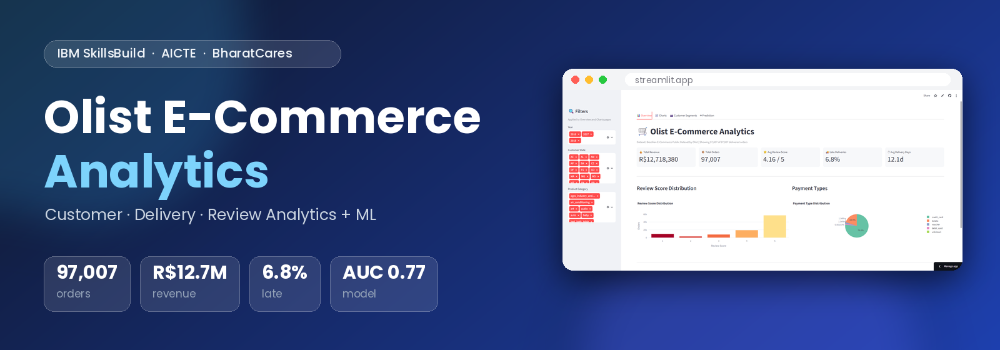
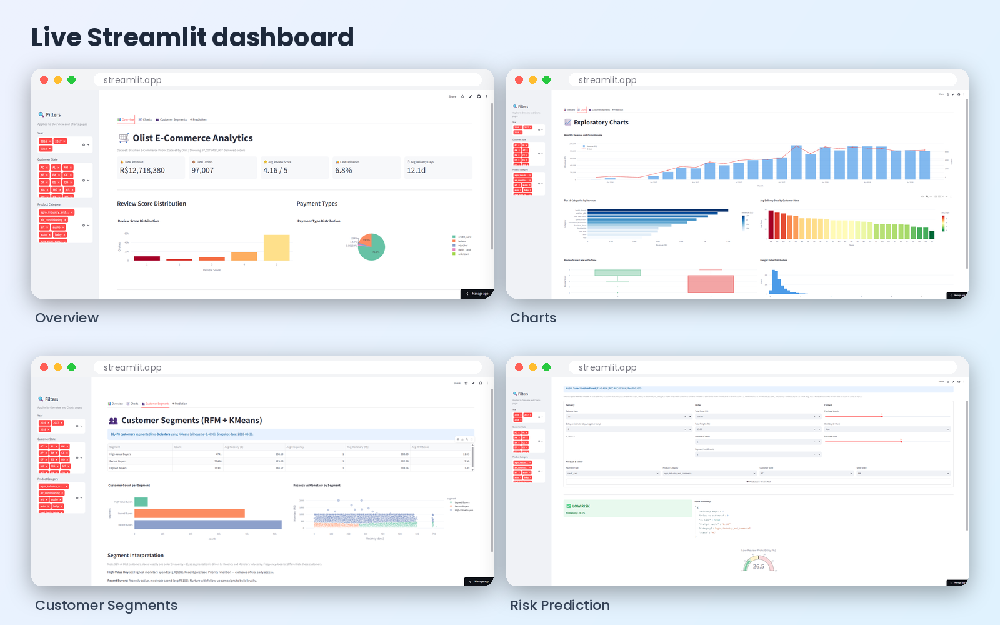
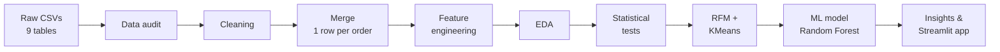
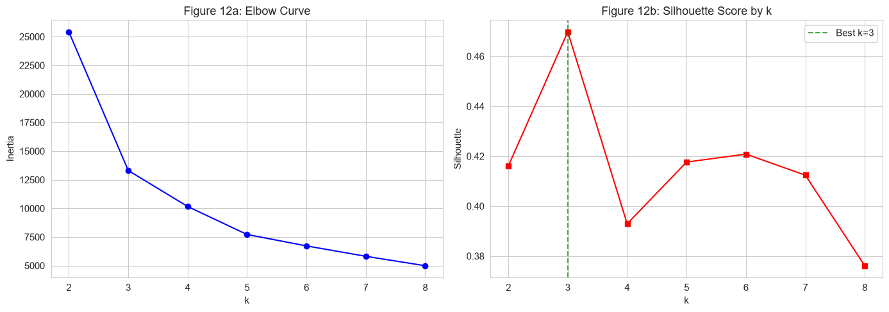
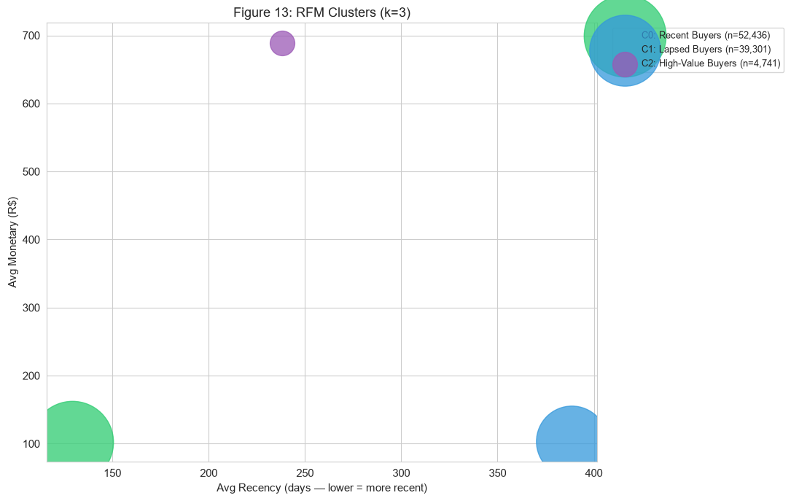
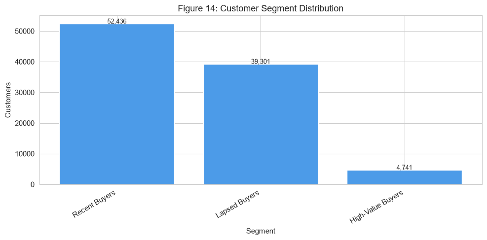

<div align="center">



<br>

[](https://bank-deposit-prediction-t7rvzukgnrhlewkzl46dyy.streamlit.app/)
[](Siddu_Varikuppala_OlistEcommerceAnalysis.ipynb)
[](https://www.kaggle.com/datasets/olistbr/brazilian-ecommerce)


**End-to-end data analytics and machine learning on 97,007 real e-commerce orders**
<br>
*AICTE | IBM SkillsBuild Data Analytics with AI Internship 2026, in association with BharatCares*

</div>

---

## 👀 Live App Preview

<div align="center">

[](https://bank-deposit-prediction-t7rvzukgnrhlewkzl46dyy.streamlit.app/)

**[👉 Click the image or here to open the live dashboard](https://bank-deposit-prediction-t7rvzukgnrhlewkzl46dyy.streamlit.app/)**
<br>
<sub>Free hosting: if the app has been idle, it may take about 30 seconds to wake up.</sub>

</div>

---

## ⚡ TL;DR

<div align="center">

| 🧾 Orders | 💰 Revenue | ⭐ Avg. Review | 🚚 Late Deliveries | 🤖 Model ROC-AUC |
|:---:|:---:|:---:|:---:|:---:|
| **97,007** | **R$12.7M** | **4.16 / 5** | **6.8%** | **0.77** |

</div>

> **Key finding:** late orders average **2.27 stars** vs **4.29 stars** for on-time orders (a large effect, r = 0.64, p < 0.001). The delay compared with the *promised* delivery date is the strongest predictor of a bad review.

---

## 📖 Table of Contents

1. [Project Overview](#-project-overview)
2. [Dataset](#-dataset)
3. [Workflow](#-workflow)
4. [Key Findings](#-key-findings)
5. [Statistical Tests](#-statistical-tests)
6. [Customer Segmentation](#-customer-segmentation)
7. [Machine Learning Model](#-machine-learning-model)
8. [Business Recommendations](#-business-recommendations)
9. [Streamlit App](#-streamlit-app)
10. [Tech Stack](#-tech-stack)
11. [Project Structure](#-project-structure)
12. [Setup & Run](#-setup--run)
13. [Limitations](#-limitations)
14. [Author](#-author)

---

## 🎯 Project Overview

Olist is a Brazilian marketplace that connects small sellers to large online stores. This project analyses its public order data from start to finish to answer four questions:

1. How do sales, customers and delivery performance vary across time, products and states?
2. Does late delivery lead to worse customer reviews?
3. What kinds of customers does the business have (RFM segmentation)?
4. Can we flag delivered orders likely to get a low review (1 to 2 stars) so the business can follow up?

It covers data auditing, cleaning, merging nine tables, feature engineering, EDA, hypothesis testing, clustering, a classification model, and an interactive Streamlit dashboard.

---

## 🗂 Dataset

- **Name:** Brazilian E-Commerce Public Dataset by Olist
- **Source:** [Kaggle: olistbr/brazilian-ecommerce](https://www.kaggle.com/datasets/olistbr/brazilian-ecommerce)
- **Size:** about 100k orders from 2016 to 2018, across 9 linked tables

<details>
<summary><b>Show the 9 tables</b></summary>

<br>

| Table | Contents |
|---|---|
| `orders` | Order status and timestamps |
| `order_items` | Products, prices and freight per order |
| `order_payments` | Payment type, installments and value |
| `order_reviews` | Review scores and comments |
| `customers` | Customer location |
| `sellers` | Seller location |
| `products` | Product category and attributes |
| `product_category_name_translation` | Portuguese to English category names |
| `geolocation` | Zip code coordinates (not used in the analysis) |

</details>

> The raw CSV files are **not included** in this repository. See [Setup & Run](#-setup--run) to download them.

---

## 🔄 Workflow



<details>
<summary><b>Cleaning and feature engineering details</b></summary>

<br>

**Cleaning:** duplicate removal, keeping the latest review per order, date parsing, missing-value handling with a justification per column, category translation, outlier handling, keeping delivered orders only, and aggregating items and payments to order level *before* joining so rows are not multiplied.

**Engineered features:** delivery days, delay versus the estimated delivery date, late flag, purchase month / weekday / hour, total price and freight, freight ratio, number of items, payment type and installments, product category, customer and seller state, and a low-review flag (score of 2 or below).

</details>

---

## 🔎 Key Findings

- **Scale:** 97,007 delivered orders generated R$12.7M in revenue.
- **Seasonality:** revenue peaked in **November 2017** (R$958,636), consistent with Black Friday.
- **Top category:** `health_beauty` led revenue at about R$1.2M.
- **Geography:** São Paulo (SP) generated about R$4.9M and had the fastest delivery (**8.3 days**). Roraima (RR) was the slowest at **29.0 days**, about 3.5 times slower.
- **Delivery:** average delivery took 12.1 days (median 10.0), and 6.8% of orders arrived late.
- **Payments:** credit cards made up 76.6% of orders.
- **Reviews:** the average score is 4.16, and 12.7% of orders got a low score (1 to 2).

<div align="center">


<sub>Exploratory charts: monthly revenue and orders, top categories, delivery days by state, review score for late vs on-time orders.</sub>

</div>

---

## 🧪 Statistical Tests

| Test | Result |
|---|---|
| **Mann-Whitney U**: review scores of late vs on-time orders | Late mean **2.27** vs on-time mean **4.29**; p < 0.001; effect size r = **0.64** (large) |
| **Chi-square + Cramér's V**: late delivery vs low review | Cramér's V = **0.39** (strong association) |

**Interpretation:** late delivery is strongly linked to low reviews. This is an association in observational data, not proof that lateness alone causes a bad review.

---

## 👥 Customer Segmentation

RFM (Recency, Frequency, Monetary) features clustered with KMeans. The silhouette score selected **k = 3** (silhouette = 0.47).

| Segment | Customers | Avg. recency (days) | Avg. spend (R$) |
|---|---:|---:|---:|
| 💎 **High-Value Buyers** | 4,741 | 238 | 689 |
| 🟢 **Recent Buyers** | 52,436 | 129 | 103 |
| 🟠 **Lapsed Buyers** | 39,301 | 389 | 103 |

> **Note:** about 96% of customers ordered only once, so frequency is 1 for nearly everyone. The segments are driven by **recency and monetary value**, and the names were chosen to match those profiles.

<div align="center">


</div>

<details>
<summary><b>More charts from the notebook</b></summary>

<br>

<div align="center">







</div>

The full set of charts is in [`outputs/figures/`](outputs/figures/).

</details>

---

## 🤖 Machine Learning Model

**Task:** predict whether a delivered order will receive a low review (1 to 2 stars).
**Model:** tuned Random Forest (`n_estimators=200`, `min_samples_leaf=4`), chosen after comparing models. Class imbalance was handled with class weights, and the split is stratified (77,599 train / 19,400 test rows).

| Metric | Value |
|---|---:|
| Accuracy | 0.848 |
| Precision | 0.420 |
| Recall | 0.507 |
| F1-score | 0.460 |
| ROC-AUC | 0.766 |

- **Most important feature:** `estimated_vs_actual_delay_days` (importance 0.182). Delay relative to the promised date matters more than raw delivery time.
- Only about 12.7% of orders are low reviews, so **accuracy alone is misleading**. Precision, recall, F1 and ROC-AUC are the metrics to read.
- This is a **post-delivery** model: it uses information known once an order has been delivered (such as the delay). It is useful for flagging orders for follow-up, not for predicting before shipping.
- Performance is **moderate**, not production-grade.

---

## 💡 Business Recommendations

1. **Fix delivery estimates, not just speed.** Delay versus the promised date is the strongest signal of a bad review.
2. **Focus on slow regions.** Long delivery times in states such as RR hurt experience and reviews.
3. **Trigger proactive outreach** (apology, discount, support message) for orders flagged as likely low reviews.
4. **Run win-back campaigns for Lapsed Buyers**, the large group of one-time customers who have not returned in about a year.
5. **Plan inventory and logistics for Q4.** Peak demand in November strains delivery, which can lead to more late orders.

---

## 🖥 Streamlit App

**🔗 [Open the live app](https://bank-deposit-prediction-t7rvzukgnrhlewkzl46dyy.streamlit.app/)**

| Page | What it shows |
|---|---|
| **Overview** | KPI cards (revenue, orders, average review, late %, delivery days) with filters for year, state and category |
| **Charts** | Revenue trend, top categories, delivery by state, review distribution |
| **Customer Segments** | RFM cluster summary and charts |
| **Prediction** | Enter order details and get a low-review probability |

Run it locally:

```bash
streamlit run app.py
```

<div align="center">

**Overview: KPI cards, review distribution and payment mix**


<br><br>

**Prediction: a low-risk and a high-risk example**


<br>


</div>

---

## 🛠 Tech Stack

| Area | Tools |
|---|---|
| Language | Python 3.11 |
| Data handling | pandas, NumPy |
| Visualisation | Matplotlib, Seaborn, Plotly |
| Statistics | SciPy |
| Machine learning | scikit-learn (pipelines, Random Forest, KMeans) |
| App | Streamlit |
| Reporting | python-docx |
| Development | Jupyter Notebook, IBM Bob AI assistant |

Exact versions are pinned in [`requirements.txt`](requirements.txt).

---

## 📁 Project Structure

```
olist-ecommerce-analytics/
├── Siddu_Varikuppala_OlistEcommerceAnalysis.ipynb   # Full analysis notebook
├── Siddu_Varikuppala_ProjectReport.docx             # Project report
├── app.py                                           # Streamlit dashboard
├── build_report.py                                  # Generates the .docx report
├── requirements.txt                                 # Python dependencies
├── README.md
├── assets/                                          # README banner and preview
├── outputs/
│   ├── figures/                                     # Charts saved from the analysis
│   └── screenshots/                                 # App screenshots
└── app_data/                                        # Compressed data + model used by the app
```

---

## ⚙️ Setup & Run

**1. Clone the repository**

```bash
git clone https://github.com/sidducv0528/olist-ecommerce-analytics.git
cd olist-ecommerce-analytics
```

**2. Create a virtual environment and install dependencies** (Python 3.11 recommended)

```bash
python -m venv venv
venv\Scripts\activate          # Windows
# source venv/bin/activate     # macOS / Linux
pip install -r requirements.txt
```

**3. Download the dataset**

Download it from [Kaggle](https://www.kaggle.com/datasets/olistbr/brazilian-ecommerce), unzip it, and place the CSV files in a folder named `data/` in the project root.

**4. Run the notebook**

```bash
jupyter notebook Siddu_Varikuppala_OlistEcommerceAnalysis.ipynb
```

Choose **Kernel > Restart & Run All**.

**5. Run the app**

```bash
streamlit run app.py
```

---

## ⚠️ Limitations

- **Moderate model performance** (F1 = 0.46, ROC-AUC = 0.77): useful for flagging risk, not for making automatic decisions.
- **Post-delivery model:** it cannot predict a bad review before the order ships.
- **One-time customers dominate** (about 96%), so RFM segmentation relies on recency and spend rather than purchase frequency.
- **Association, not causation:** late delivery is strongly linked to low reviews, but other factors also influence ratings.
- **Historical data:** the data covers 2016 to 2018 in Brazil, so patterns may not carry over to other markets or years.

---

## 👤 Author

**Siddu Varikuppala**
B.Sc. (Honours) Mathematics, Statistics & Data Science, Hyderabad, India
GitHub: [@sidducv0528](https://github.com/sidducv0528)

### 🙏 Acknowledgements

- **AICTE** and **IBM SkillsBuild**, through **BharatCares**, for the Data Analytics with AI internship
- **Olist** and **Kaggle** for the public dataset
- **IBM Bob** AI assistant, used during development

---

<div align="center">

⭐ If you found this project useful, consider giving it a star.

</div>
